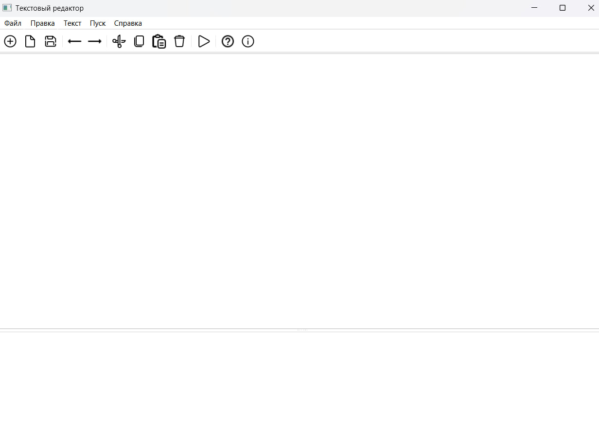
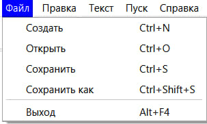
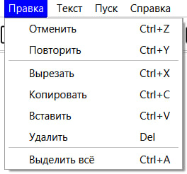
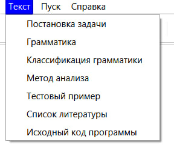
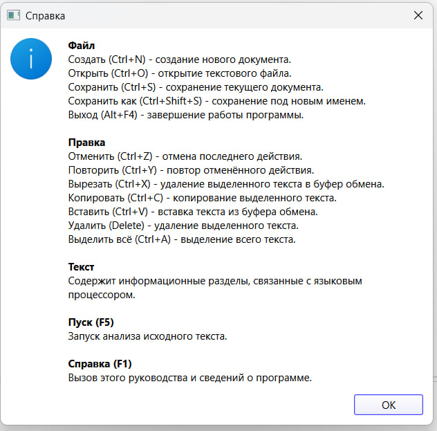
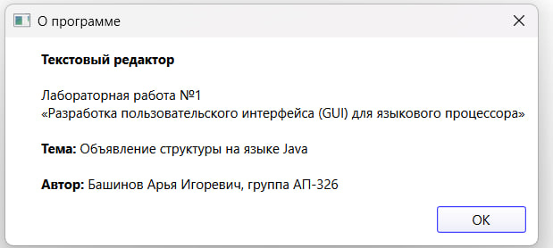
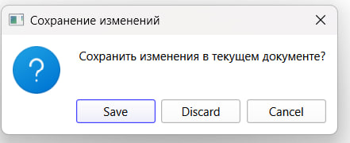

# Лабораторная работа №1 — Разработка GUI для языкового процессора (текстовый редактор)

## Цель работы
Разработать оконное приложение — текстовый редактор, которое в дальнейшем будет расширено до полноценного языкового процессора для анализа исходного кода.

## Автор
+ Башинов Арья Игоревич
+ Группа: АП-326

## Описание проекта
Приложение представляет собой текстовый редактор с графическим интерфейсом пользователя.

Интерфейс содержит четыре основные области:
+ Основное меню программы.
+ Панель инструментов с кнопками для быстрого доступа к часто используемым функциям.
+ Область ввода/редактирования текста (текстовый редактор).
+ Область отображения результатов работы языкового процессора (только для вывода, без возможности редактирования).

Пользователь может изменять соотношение размеров области редактирования и области вывода результатов перетаскиванием разделителя, а также размеры всего окна приложения. При необходимости автоматически появляются полосы прокрутки.

## Реализованные функции

### Меню «Файл»
+ Создать — создание нового документа.
+ Открыть — открытие текстового файла в кодировке UTF-8.
+ Сохранить — сохранение текущих изменений.
+ Сохранить как — сохранение документа под новым именем.
+ Выход — выход из приложения с подтверждением сохранения изменений.

### Меню «Правка»
+ Отменить — отмена последнего действия.
+ Повторить — повтор отменённого действия.
+ Вырезать — удаление выделенного фрагмента в буфер обмена.
+ Копировать — копирование выделенного фрагмента.
+ Вставить — вставка текста из буфера обмена.
+ Удалить — удаление выделенного фрагмента.
+ Выделить всё — выделение всего текста редактора.

### Меню «Текст»
Содержит информационные разделы, связанные с будущим языковым процессором:
+ Постановка задачи.
+ Грамматика.
+ Классификация грамматики.
+ Метод анализа.
+ Тестовый пример.
+ Список литературы.
+ Исходный код программы.

На данном этапе каждый пункт открывает окно с кратким описанием раздела. Содержимое будет наполнено в следующих лабораторных работах.

### Команда «Пуск»
Запуск анализа текста и вывод результатов в область результатов. На данном этапе выводится демонстрационное сообщение о том, что анализатор ещё не реализован.

### Меню «Справка»
+ Вызов справки — описание реализованных функций и горячих клавиш.
+ О программе — сведения о приложении и авторе.

## Панель инструментов
Панель инструментов дублирует основные пункты меню «Файл», «Правка», «Справка» и команду «Пуск». Кнопки содержат только иконки; в раскрывающихся меню иконки не отображаются.

## Горячие клавиши
| Действие | Клавиши |
| --- | --- |
| Создать | Ctrl+N |
| Открыть | Ctrl+O |
| Сохранить | Ctrl+S |
| Сохранить как | Ctrl+Shift+S |
| Выход | Alt+F4 |
| Отменить | Ctrl+Z |
| Повторить | Ctrl+Y |
| Вырезать | Ctrl+X |
| Копировать | Ctrl+C |
| Вставить | Ctrl+V |
| Удалить | Delete |
| Выделить всё | Ctrl+A |
| Пуск | F5 |
| Вызов справки | F1 |

## Используемые технологии
+ Язык программирования: Python 3.10+
+ GUI-фреймворк: PySide6 (Qt for Python)
+ Среда разработки: Visual Studio Code

## Инструкция по сборке и запуску
Клонировать репозиторий:
```powershell
git clone https://github.com/korposs/TFYAK_Lab1.git
cd TFYAK_Lab1
```

Установить зависимости:
```powershell
py -m pip install -r requirements.txt
```

Запустить приложение:
```powershell
py main.py
```

В средах, где Python запускается командой `python`, использовать её вместо `py`. Все команды выполняются из корня репозитория. Отдельная компиляция не требуется.

## Руководство пользователя

### Главное окно


В окне расположены четыре основные области:
+ сверху — основное меню программы (Файл, Правка, Текст, Пуск, Справка);
+ под меню — панель инструментов с кнопками быстрого доступа;
+ в центре — область редактирования текста;
+ внизу — область вывода результатов работы языкового процессора (только для чтения).

Соотношение размеров редактора и области вывода можно изменять перетаскиванием горизонтального разделителя.

### Меню «Файл»


Документ создаётся командой «Файл → Создать» или сочетанием Ctrl+N. Существующий файл открывается через «Файл → Открыть» (Ctrl+O). Файлы читаются и сохраняются в кодировке UTF-8. Для записи изменений служат «Сохранить» (Ctrl+S) и «Сохранить как» (Ctrl+Shift+S). При попытке закрыть документ с несохранёнными изменениями программа предлагает сохранить его.

### Меню «Правка»


Меню «Правка» содержит стандартные операции с текстом: отмена и повтор действий, вырезание, копирование, вставка, удаление и выделение всего текста.

### Меню «Текст» и «Справка»


Меню «Текст» содержит семь информационных разделов, относящихся к будущему языковому процессору. Каждый пункт открывает окно с кратким описанием.

Меню «Справка» содержит вызов руководства пользователя (F1) и окно «О программе».

### Справка


Окно справки открывается командой «Справка → Вызов справки» или клавишей F1. В нём перечислены все реализованные функции меню с указанием горячих клавиш.

### О программе


Открывается командой «Справка → О программе». Содержит название приложения, номер лабораторной работы и сведения об авторе.

### Подтверждение сохранения при выходе


Если документ был изменён и не сохранён, при закрытии окна или создании нового документа появляется запрос с вариантами «Сохранить», «Не сохранять» и «Отмена».

## Структура проекта
```text
TFYAK_Lab1/
├── main.py                  # точка входа приложения
├── text_editor.py           # класс главного окна и логика редактора
├── requirements.txt         # зависимости проекта
├── README.md
├── .gitignore
├── resources/
│   └── icons/               # иконки панели инструментов
└── images/                  # иллюстрации для README
```

## Ограничения
+ Языковой анализатор не реализован: команда «Пуск» выводит демонстрационное сообщение. Полноценный анализ исходного кода появится в следующих лабораторных работах.
+ Пункты меню «Текст» открывают окна с краткими описаниями-заглушками. Содержимое будет наполнено позднее.
+ Поддерживается работа с одним документом в одном окне. Работа с вкладками не реализована.
+ Подсветка синтаксиса отсутствует.
+ Файлы читаются и сохраняются только в кодировке UTF-8.
